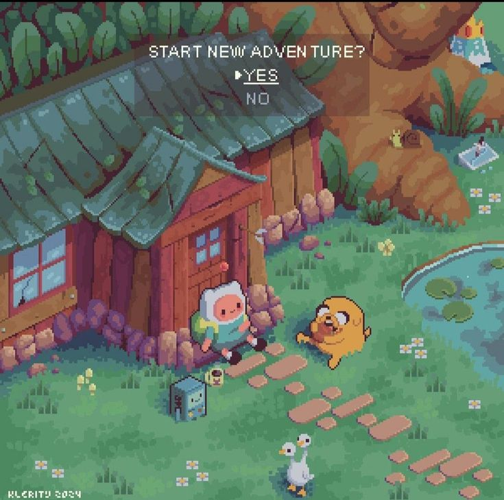

<h1 align="left">Ça va?</h1>

###

<table>
  <tr>
    <td style="vertical-align: top;">
      <pre><code>

  My name is Vivian, I'm 20 yo and I'm brazillian. 
  I began this weird but exciting tech journey in 2023.
  Wish me luck 🥲☕

   About me
  ✨ Creating bugs since 2024
  📚 I'm currently learning JavaScript and Typescript
  🎲 Fun fact: I love drawing and painting
  🎨 I create very cute prototypes in Figma

</code></pre>

</td>
<td style="vertical-align: top;">

</td>

  </tr>
</table>

  <h2> I work with </h2>

  
  
  
  
  
  
  
  
  
  
  
  
  
  
  
  
  

###
